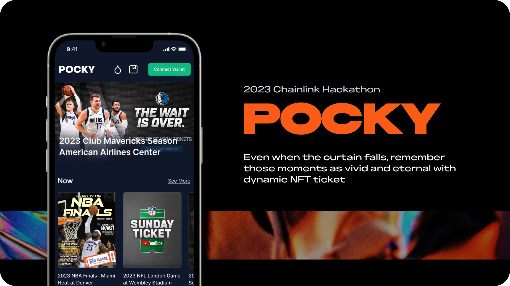

### Even when the curtain falls,   remember those moments as vivid and eternal with dynamic NFT ticket.

Pocky is a revolutionary Web3 sports ticket platform that utilizes dynamic Non-Fungible Tokens (dNFTs).
Here, sports event tickets can be bought and sold, with each ticket is a dynamic NFT that changes by the result of the corresponding match.
This innovative feature allows users to vividly remember and cherish those memorable moments.

Leveraging the power of [Chainlink](https://chain.link/), Pocky is capable of autonomously retrieving sports match results from external APIs,
subsequently updating the corresponding dNFT images based on these results.
This process operates entirely on-chain, ensuring that your digital assets continue to exist and thrive,
undeterred by external factors, thanks to the unlimited fuel provided by Chainlink.
